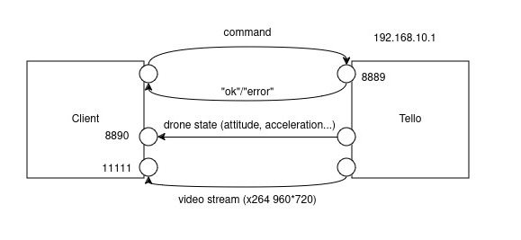

# Autonomous navigation for DJI Tello

## Overview

The DJI Tello Drone is ~100€ drone equipped with a fixed forward-facing camera and a downward facing infrared sensor.

This repository is a C++ project where we try to see how we can add more functionalities (navigation, autonomous flight, stabilization...) to the drone.

You can find in this repository a : 
- C++ application with a GUI that enables you to send commands to the drone, receive the drone state data, decode the drone video stream, and enable face/object tracking.
- Trajectory visualizer (soon...)

This is also a summary of all the research I've done on the drone and its hardware to understand how it works and how I can improve it.

## Table of contents
- [Introduction](#introduction)
- [Goals](#goals)
- [Features](#features)
- [DJI Tello SDK details](#dji-tello-sdk)
  - [Commands](#commands)
  - [Drone state](#drone-state)
  - [Video streaming](#video-streaming)
- [Upgrades](#upgrades)
- [Getting started](#getting-started)

## Introduction



When powered on, the drone creates a WiFi hostpost (Tello - XXXX), connecting to this WiFi and sending the string "command" via UDP to 192.168.10.1:8889 will enable the SDK mode. In this mode, the drone can be controlled by sending command strings to this port.

The drone will also send a data string on your local 8890 port, containing various data such as remaining battery, drone attitude...

When the "streamon" command is sent, you can retrieve a video stream on port 11111.

This SDK is pretty much all you have to interact with the drone. 

[SDK Details](#dji-tello-sdk)

The point of this project is to try to use vision based algorithm to enhance the capabilities of the drone. We will create control loops where we : 
- will receive an image from the drone
- search for faces or objects for example
- find how far we drifted from the target
- send a correction to the drone
- repeat


## Goals

- Control the drone using a GUI, a gamepad or keyboard
- Achieve indoor navigation between defined waypoints
- Achieve tracking of objects or people
- 3D visualization of the drone trajectory and attitudes, maybe even of the mapped environment obtained by visual SLAM ?

## Features 

+++

- [x] Drone manual control with GUI and getting drone data back
- [x] Drone video stream decoding
- [x] Face detection and tracking
- [x] Aruco marker detection
- [ ] Use aruco (or other) to hover
- [ ] Collision avoidance
- [ ] Use a visual SLAM for navigations

++

- [ ] Control with hand gestures ?
- [ ] Object detection ?
- [ ] Following target
- [ ] Circling around target ?

## DJI Tello SDK

### Commands

All the move and rotate commands (up,down,left,right,forward,cw...) are way too slow, the drone is unresponsive and cannot receive anymore command until the movement has been completed. Even if the action has been completed, you need to wait 100ms between every command you send otherwise the drone will ignore it. 

The RC commands on the other hand are fast to execute and the drone can receive new commands (one every ~10ms), this is why we're only using RC commands to control the drone in this program.

| Name | Description |
|------|-------------|
| command | Enter SDK mode |
| takeoff | Auto takeoff |
| land | Auto landing |
| streamon | Enable video streaming |
| streamoff | Disable video streaming |
| emergency | Stops all motors |
| up,down,left,right,forward,back x | Move the drone in the desired direction, x = 20-500 cm |
| cw,ccw x | Rotate clockwise or anti clockwisze, x=1-360 degrees |
| flip x | Flips in x direction, x = "l"=left, "r", "f", "b" |
| go x y z speed | Fly to x y z at speed (cm/s) x,y,z = -500-500, speed = 10-200 |
| stop  | Hovers |
| curve x1 y1 z1 x2 y2 z2 speed | Fly at a curve ?? |
| speed x  | Set speed to x cm/s, x=10-100 ?? |
| rc a b c d  | Remote controller control : a = left/right (-100-100), b = forward/backward(-100-100), c = up/down(-100-100), d = yaw(-100,100) |

### Drone state

Data string received : 
``` C
“pitch:%d;roll:%d;yaw:%d;vgx:%d;vgy%d;vgz:%d;templ:%d;temph:%d;tof:%d;h:%d;bat:%d;baro:%
.2f; time:%d;agx:%.2f;agy:%.2f;agz:%.2f;\r\n”
```

| Name | Description | Unit |
|------|-------------|------|
| roll, pitch, yaw | drone attitude           | degree |
| vgx, vgy, vgz| drone velocity             | cm/s |
| agx, agy, agz| drone acceleration             | cm/s²|
| templ  | lowest temperature             | °C |
| temph  | highest temperature             | °C |
| tof  | time of flight : current drone distance to ground            | cm |
| h  | height above drone starting point         | cm |
| baro  | barometer measurement         | cm |
| bat | drone battery         | % |
| time | amount of time since motor start         | seconds |

### Video streaming

Once the "streamon" command is sent, you can receive a x264 video streaming from the drone on your local 11111 port.

You can easily decode it with opencv, we used  a gstreamer pipeline in this project.

## Upgrades

There is a way to mod and improve the hardware of the drone without doing any soldering on the tello battery. By plugging a USB OTG adapter on the USB port of the drone, you can power small devices such as a Arduino nano. This enables you to power and control additional hardware such as sensors, LEDs...

## Getting started

### Dependencies

- ImGui
- OpenCV
- Eigen


